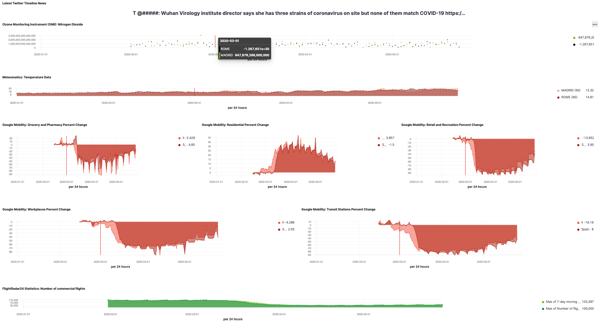

# COVID-19 Pandemic Integrated Simulator

Screenshot of the ELK dashboard based on Elasticsearch 

Interactive timelines the Covid-19 pandemic in Madrid, Milan and Rome based on Plotly framework

* [Covid-19 timeline Madrid](https://htmlpreview.github.io/?https://github.com/isachse/SpaceAppsChallenge-COVID-19-Pandemic-Integrated-Simulator/blob/master/html/MadridCovid-19_timeline.html)
* [Covid-19 timeline Milan](https://htmlpreview.github.io/?https://github.com/isachse/SpaceAppsChallenge-COVID-19-Pandemic-Integrated-Simulator/blob/master/html/MilianCovid-19_timeline.html)
* [Covid-19 timeline Rome](https://htmlpreview.github.io/?https://github.com/isachse/SpaceAppsChallenge-COVID-19-Pandemic-Integrated-Simulator/blob/master/html/RomeCovid-19_timeline.html)

## The Challenge
Your challenge is to integrate various Earth Observation-derived features with available socio-economic data in order to discover or enhance our understanding of COVID-19 impacts.

## Datasources

### Earth Observation-derived Datasets

#### meteomatics API
- Trial account https://www.meteomatics.com/covid-19/
- Guide https://www.meteomatics.com/en/api/getting-started/
- Madrid temperature data: https://api.meteomatics.com/2020-01-01T00:00:00ZP5M:PT1H/t_2m:C/40.416775,-3.703790/csv?model=mix
- Rome temperature data: https://api.meteomatics.com/2020-01-01T00:00:00ZP5M:PT1H/t_2m:C/41.902782,12.496366/csv?model=mix

#### Ozone Monitoring Instrument (OMI)
- https://giovanni.gsfc.nasa.gov/giovanni
- Nitrogen Dioxide: "The number of molecules of NO2 in an atmospheric column (from the Earth's surface to the top of the atmosphere) above a square centimeter of the surface. In L2G Giovanni, NO2 data is provided only for near clear sky conditions (i.e only those NO2 retrievals are used in the analysis for which Cloud radiance fraction is less than 30%)." (https://disc.gsfc.nasa.gov/information/glossary?title=Giovanni%20Parameter%20Definitions:%20Nitrogen%20Dioxide)

### Socio-economic Datasets

#### FlightRadar Statistics
- Number of commercial flights tracked by Flightradar24, per day (UTC time), last 120 days
- Statistic CSVs https://www.flightradar24.com/data/statistics

#### Google COVID-19 Community Mobility Report
- "The reports chart movement trends over time by geography, across different categories of places such as retail and recreation, groceries and pharmacies, parks, transit stations, workplaces, and residential."
- https://www.google.com/covid19/mobility/ 

#### Twitter timeline sample
- Small sample dataset of retweeted COVID-19 news since beginning 2020
- Not representative, just showcase dataset

## Visualization Technologies

### Splunk Enterprise
- Free, closed source option might fit major requirements
- Option was discarded by SpaceApps GO team because of missing usage approval from the vendor
- https://www.splunk.com

### Tableau Desktop
- 14 days trial license available as they are official partner of SpaceApps challenge
- Works fine for ad-hoc analyzes, but missing options to publish the results for interactive usage as long you stay at the desktop version without cloud component
- https://www.tableau.com/de-de/products/desktop

### ELK (Elasticsearch, Logsdash, Kibana) - Stack
- Apache 2.0 licensed stack of applications for data analysis especially for IT operations
- Good to use for time series data
- Open source edition is missing proper authentication mechanisms which makes it useless for long term solution
- Commercial components which heals that problem are not allowed in context of SpaceApps challenge
- https://www.elastic.co/de/what-is/elk-stack

### Plotly Python Open Source Graphing Library
- Python library to generate visualizations as dynamic content for website creation
- https://plotly.com/python/
